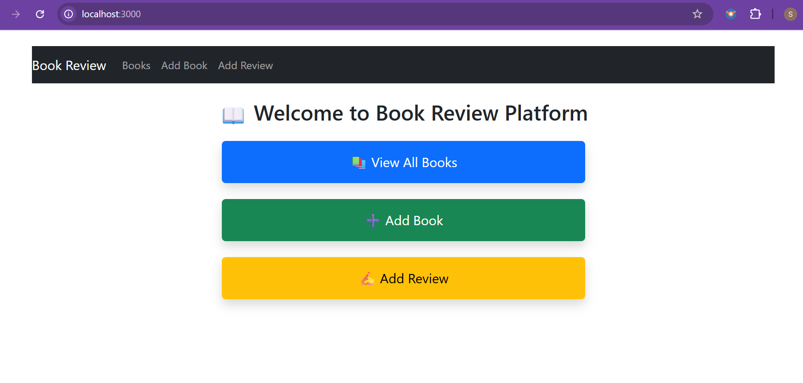
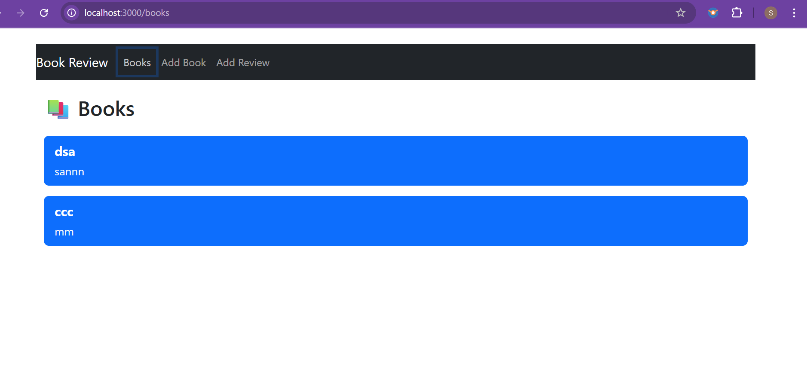
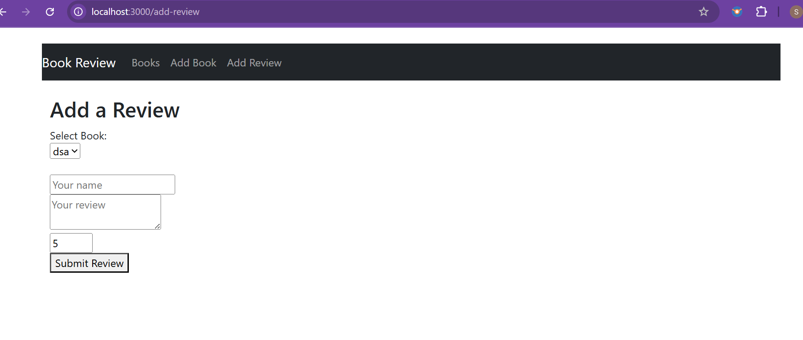

# 📚 Book Review Platform

A full-stack web application that allows users to add books and write reviews for them.

---

## 📁 Project Structure
book-review-platform/
├── client/ # React frontend
└── server/ # Node.js + Express backend with MongoDB

---

## 🚀 Features

- Add new books with title, author, description
- View list of all books
- Submit and view reviews for each book
- RESTful API using Express & MongoDB
- Responsive UI built with React

---

## 🛠️ Tech Stack

### Frontend:
- React
- Axios
- React Router DOM
- Bootstrap

### Backend:
- Node.js
- Express.js
- MongoDB (via Mongoose)
- CORS
- dotenv

---

## ⚙️ Setup Instructions

### 📦 Clone the Repository

```
git clone https://github.com/Savitha703/book-review-platform.git
cd book-review-platform
```
🔧 Backend Setup (server/)
```
cd server
npm install
```
Create a .env file:
```
MONGO_URI=mongodb://localhost:27017/bookReviewPlatform
PORT=5000
Start MongoDB (mongod)
```

Start server:
```
node server.js
```
🎨 Frontend Setup (client/)
```
cd ../client
npm install
npm start
````
Open http://localhost:3000 in your browser.
📸 Screenshots
#### 🏠 Homepage

#### 📚 Book List

#### ✍️ Add Review Page


🤝 Author
Savitha R — GitHub


